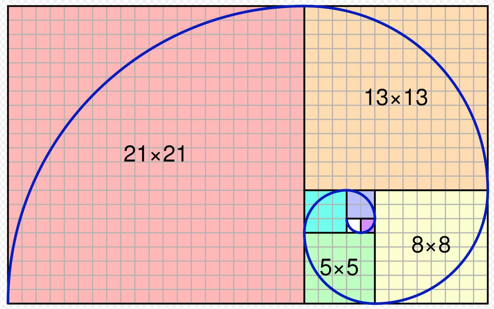
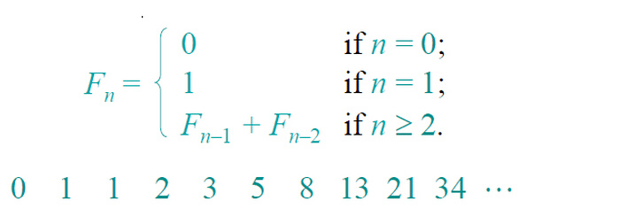

# 斐波那契数列(Fibonacci)

学过数学的同学都知道，**斐波那契数列在数学和生活以及自然界中都非常有用！**

关于斐波那契数列的定义可以参考这里：[菲波那切数列](https://baike.baidu.com/item/%E6%96%90%E6%B3%A2%E9%82%A3%E5%A5%91%E6%95%B0%E5%88%97/99145)

这里我们不研究数学，就把它的计算公式列举如下：

今天我们就是用TDD的方式用Java来实现计算菲波那切数列的函数出来。

## 需求描述

只有清楚了需求，我们才能知道这个公式到底有哪些场景：

* **AC1: 当给定输入项数为0时，函数返回0。**
* **AC2: 当给定输入项数为1时，函数返回1。**
* **AC3: 当给定输入项数大于等于2时，此函数返回的值为前两个项值的和。**
* **AC4: 当给定输入项数小于等于0时，此函数报错：项数不能为负值。**

## Tasking

TDD中，tasking是必须的环境，所有的tasks必须来源于AC的描述。下面我们将所有AC拆分为Task。

- [ ] **Task1:** 实现一个函数，当输入参数为0时，返回值为0
- [ ] **Task2:** 实现一个函数，当输入参数为1时，返回值为1
- [ ] **Task3:** 实现一个函数，当输入参数为2时，返回值为1
- [ ] **Task4:** 实现一个函数，当输入参数为3时，返回值为2
- [ ] **Task5:** 实现一个函数，当输入参数为4时，返回值为3
- [ ] **Task6:** 实现一个函数，当输入参数为-1时，抛出`IndexOutOfBoundsException`异常

## 你该怎么做？

### Step 1: Clone此仓库
请将此项目Clone到你本地：`https://github.com/Jinghua-Li/fibonacci.git`

### Step 2: 构建此项目
请使用命令`./gradlew clean build`来下载相关依赖并构建此项目

### Step 3: 查看其所有实现
构建成功之后，Master分支已经使用TDD的方式实现了所有Tasks，你可以通过`git history`来查看实现过程。

### Step 4: 自己练习实现
如果你自己想练习如何使用TDD的方式来实现菲波那切数列，请切换到`tdd`分支，这个分支包含了基本的脚手代码，你可以就此分支来进行练习。

